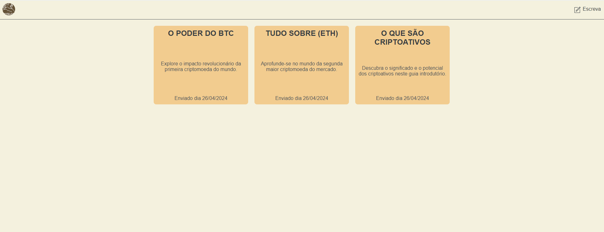

<h1 align="center"> Projeto com FullStack </h1>

# 🖥️ MyBlog

O MyBlog é um projeto FullStack desenvolvido para criar e ler artigos publicados. É uma plataforma robusta e intuitiva que permite aos usuários compartilhar e descobrir conteúdos.

## 👨‍💻 Tecnologias
Esse projeto foi desenvolvido utilizando as seguintes tecnologias:
- HTML
- CSS
- JAVASCRIPT
- EXPRESS.JS
- EJS
- NODE.JS

## 📝 Descrição

O MyBlog é um projeto FullStack desenvolvido utilizando as tecnologias aprendidas no curso "The Complete 2024 Web Developers" da Udemy. Este projeto oferece aos usuários a capacidade de criar, ler e compartilhar artigos sobre uma variedade de tópicos relacionados a criptoativos e tecnologia blockchain.

O backend do MyBlog é construído em Node.js e Express.js, enquanto o frontend é desenvolvido com HTML, CSS e JavaScript.

Além disso, o MyBlog inclui recursos como a geração automática de IDs únicos para cada artigo, suporte para envio de novos artigos via formulário, e a capacidade de visualizar artigos individuais por meio de URLs dinâmicas.

Este projeto é uma demonstração prática do aprendizado adquirido durante o curso e serve como uma plataforma para compartilhar conhecimento e promover a discussão sobre criptoativos e tecnologia blockchain.

## Funcionalidades

- Visualização de Artigos: Os usuários podem visualizar uma lista de artigos disponíveis na página inicial do MyBlog. Cada artigo exibe o título, descrição e data de publicação.

- Leitura de Artigos Individuais: Os usuários podem clicar em um artigo para ler seu conteúdo completo em uma página dedicada.

- Adição de Novos Artigos: Existe a capacidade de adicionar novos artigos por meio de um formulário acessível pela rota "/addPost". Os novos artigos são adicionados ao conjunto de dados inicial e imediatamente disponibilizados para visualização na página inicial.

- Responsividade: O MyBlog é responsivo, o que significa que ele se adapta a diferentes tamanhos de tela, garantindo uma experiência de usuário consistente em dispositivos móveis e desktops.

- URLs Dinâmicas: Cada artigo tem uma URL única baseada em seu ID, o que permite aos usuários acessar facilmente artigos específicos diretamente por meio de seus links.

- Geração de IDs Únicos: Cada artigo é atribuído a um ID único gerado automaticamente, garantindo que não haja conflitos de identificação entre os artigos.